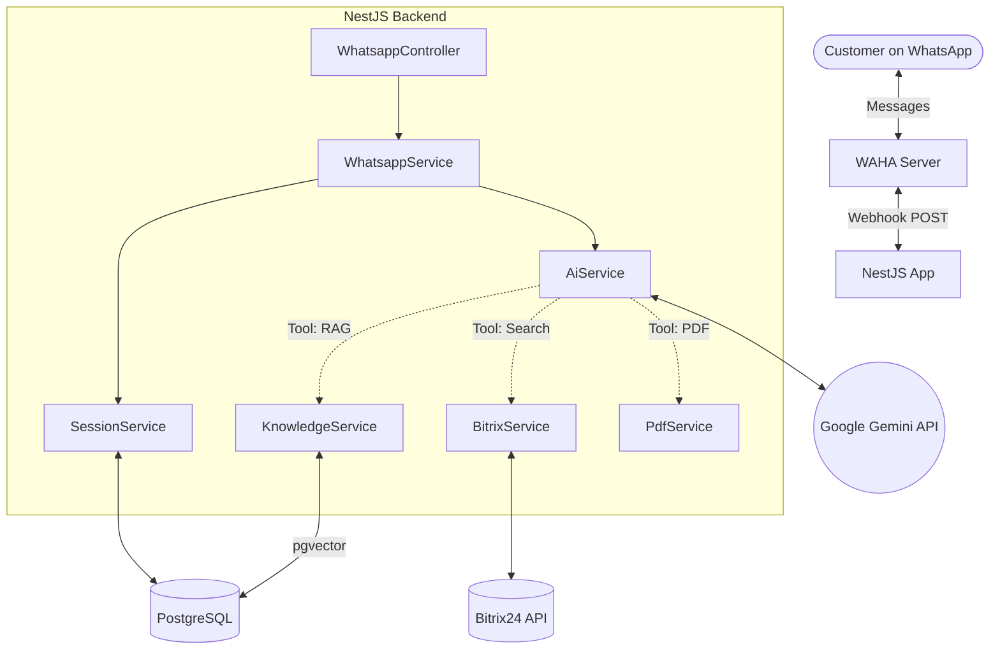

<h1 align="center">PCI WhatsApp Bot V2 🏢🤖</h1>

<p align="center">
  <strong>Enterprise-grade AI Real Estate Assistant built on NestJS & Gemini 2.5</strong>
</p>

## Overview
The PCI WhatsApp Bot V2 is an intelligent, conversational agent designed for **Premier Choice International**. It interfaces directly with customers over WhatsApp via WAHA, acting as a highly structured real estate Sales Executive. 

It autonomously queries live Bitrix24 inventory, answers complex project queries using a vectorized knowledge base (RAG), and dynamically generates branded PDF payment plan proposals on the fly.

## Key Features
- 🧠 **LLM Orchestration**: Powered by Google Gemini 2.5 Flash, utilizing native function calling for intent routing.
- 🏢 **Live Inventory Sync**: Custom integration with the Bitrix24 Proxy to pull real-time project availability and pricing.
- 📚 **Semantic RAG Search**: Uses PostgreSQL + `pgvector` to semantically match customer questions against scraped marketing brochures.
- 📄 **Dynamic PDF Generation**: Procedurally draws customized payment plan PDFs (via `pdf-lib`) and delivers them as WhatsApp attachments.
- 💾 **Session Identity Tracking**: Maintains persistent conversational history and user profiles across multiple chat sessions.

## High-Level Architecture



## Quick Start

### 1. Requirements
- Node.js >= 18
- PostgreSQL >= 15 with `pgvector` extension
- WAHA (WhatsApp HTTP API) Docker Container

### 2. Installation
```bash
$ npm install
```

### 3. Environment Configuration
Copy the `.env.example` file to `.env` and fill in your credentials.
```bash
DATABASE_URL="postgresql://..."
GEMINI_API_KEY="..."
BITRIX_API_BASE="..."
WAHA_API_BASE="..."
```

### 4. Database Setup
```bash
$ npx prisma db push
$ npx prisma generate
```

### 5. Running the App
```bash
# Watch mode (Development)
$ npm run start:dev

# Production Build
$ npm run build
$ npm run start:prod
```

## Documentation Directory
For deep-dive technical overviews, please refer to the `/docs` folder:
- [Architecture & Workflows](./docs/ARCHITECTURE.md)
- [Bitrix Integration specifics](./docs/BITRIX_INTEGRATION.md)
- [Contribution Guide](./CONTRIBUTING.md)
