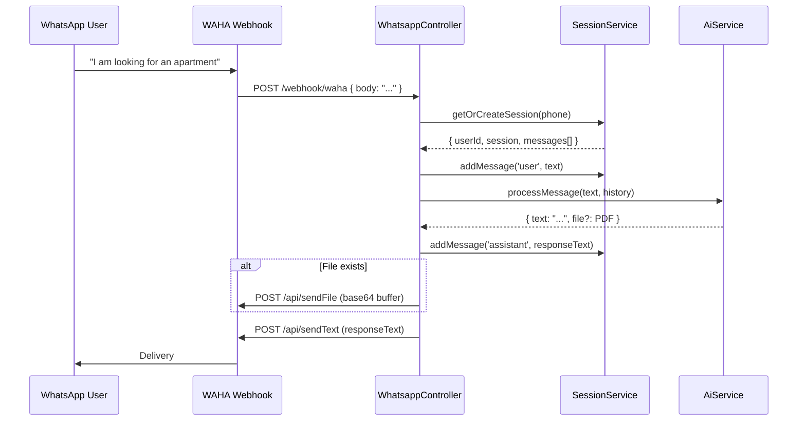
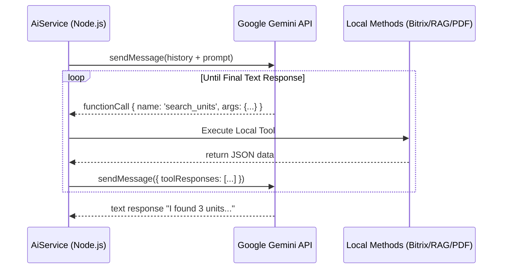
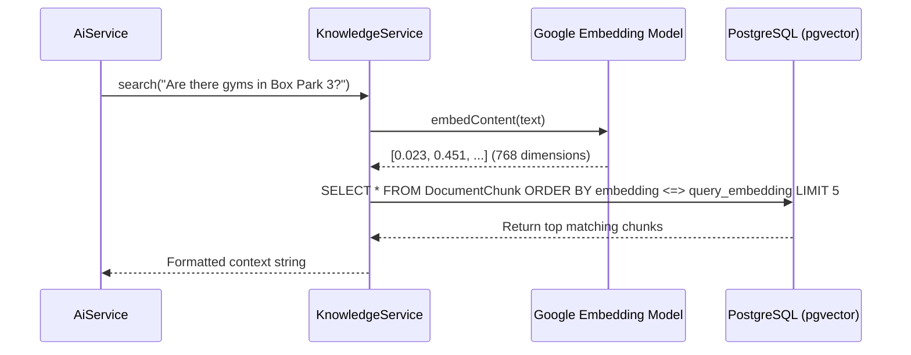
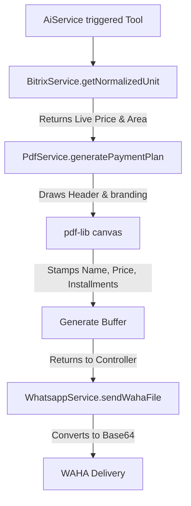

# System Architecture & Workflows

This document outlines the high-level architecture and execution flows of the PCI WhatsApp Bot V2.

## 1. Webhook & Message Lifecycle Flow
When a customer sends a message on WhatsApp, it passes through WAHA into our NestJS Webhook controller. We instantly fetch the user's conversational history to maintain memory.

## 2. LLM Orchestration Flow (AiService)
The `AiService` uses the Google Gemini 2.5 Flash model with **Function Calling (Tools)**. The model acts autonomously inside a `while` loop, invoking database connections as needed until it has enough data to formulate a final reply.

## 3. Knowledge Base RAG Flow
When a user asks complex questions about a project's amenities, location, or FAQs, the Gemini model triggers the `get_project_info` tool. This performs a Semantic Search against the `pgvector` database.

## 4. Procedural PDF Generation Flow
When the bot negotiates a final unit, it generates a branded PDF using `pdf-lib` via the `generate_and_send_proposal` tool.

